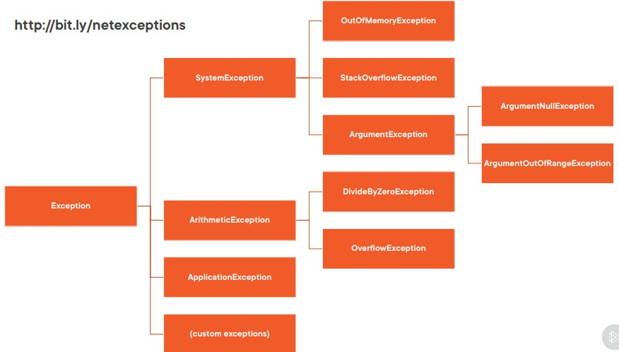

# Error Handling in C# 10

Introducing the Try Statement

```csharp
    try
    {
        // Some operation(s)
    }
    catch (ArgumentNullException ex)
    {
        // Handle ArgumentNullException
    }
    catch (InvalidOperationException ex)
    {
        // Handle InvalidOperationException
    }
    catch (Exception ex)
    {
        // Handle all other exceptions
    }
    finally
    {
        // Always executed when control leaves try block
    }
```

Exception Handling Good Practices

> Do not add a catch block that does nothing or just rethrows

    - Catch block should add some value
    - May just be to log the error
    - Usually bad practice to ignore (swallow/trap) 
    - exceptions

> Do not use exceptions for normal program flow logic

    E.g. input validation
    - You expect input to be invalid sometimes
    - Not an exceptional situation
    - Part of expected logic flow
    IsValid(xxx) method(s)

## Understanding the Exception Class Hierarchy

Exception : An exception is any error condition or unexpected behavior that is encountered by an executing program.

> System and Application Exceptions
- System : 
  - .NET Runtime (CLR)
-     .NET
    -  OutOfMemory
    -  StackOverflow
- Third party
  -    Libraries/frameworks
  -    JsonSerialization
- Your code
    - RulesEngine

The actual type of the exception class represents the kind of error that occurred. 

Any additional property values that are set help to further refine/define the error.

## The Exception Class Hierarchy


The System.Exception class is the base class for all types of exceptions

> System.Exception Properties

- Message:
    - String
    - Describes the reason for the exception
    - Write for the developer who going to 
    - handling the exception
    - Should completely describe the error
    - Should describe how to correct error (where possible/applicable)
    - May sometimes be shown to end-user
    - May sometimes be logged
    - Correct grammar
    - Don’t include passwords/security/sensitive data  
- StackTrace
    - String
    - Information about call stack
    - Trace of the method calls leading to exception
    - Helps to show the execution path/flow that led to exception
- Data
    - IDictionary
    - Key/value pairs
    - String key
    - Object value
    - Arbitrary number of items
    - Additional/supplementary user-defined 
    - exception data
    - Don’t include passwords/security/sensitive 
    - data in keys/values
    - Be careful of key conflicts
- InnerException
    - System.Exception
    - Capture the preceding exception in new exception
    - Exception “wrapping”
- Source
    - String
    - Application/object name that caused error
    - Defaults to name of originating assembly
- HResult
    - Int32
    - Represents a HRESULT numerical value
    - Often used with COM-interop
- HelpLink
    - String
    - Link to associated help file
    - Uniform Resource Name (URN)
    - Uniform Resource Locator (URL)
- TargetSite
    -   System.Reflection.MethodBase
    -   Method that threw current exception
        - Name
        - Return type
        - Is public/private
        - Etc.

```csharp
        // Default Message property and null InnerException
        public Exception()

        // User defined Message
        public Exception(string message)

        public Exception(
            string message, //User defined Message
            Exception innerException //Wrapped exception

        )
```

“System.ApplicationException is a class that should not be part of the .NET Framework. The original idea was that classes derived from SystemException would indicate exceptions thrown from the CLR (or system) itself, whereas non-CLR exceptions would be derived from ApplicationException. However, a lot of exception classes didn’t follow this pattern.

> ApplicationException Guidelines
-   An ApplicationException should not be thrown by your code
-   An ApplicationException exception should not be caught (unless you rethrow the original exception)
-   Custom exceptions should not be derived from ApplicationException
  
> Commonly Encountered Exceptions

-   Exception: Represents execution errors
-   SystemException: Base class for exceptions in 
-   system exceptions namespace
-   Do not throw
-   Do not catch (except in top-level handlers)
-   Do not catch in framework code (unless rethrowing)

> InvalidOperationException: 
    - Thrown when the current state of the object is invalid for a specific method being called
    - Throw when your object is in an inappropriate state when a method is called

> ArgumentException: Thrown when a method argument is invalid. (base class)
> ArgumentNullException: Thrown when a null is passed to a method argument and it cannot accept nulls
> ArgumentOutOfRangeException: Thrown when a method argument is outside of an allowable range

**Prefer** the most specific derived exception 
**Set** the ParamName property when throwing one of the subclasses of ArgumentException

> NullReferenceException: Thrown when an attempt is made to dereference a null object reference
> IndexOutOfRangeException: Thrown when attempting to access an array/collection item that is outside its bounds
-   Reserved for runtime use
-   Usually indicate a bug in the program
-   Do not throw
-   Check arguments to avoid

> StackOverflowException : Thrown when too many nested method calls cause the execution stack to overflow
-   Reserved and thrown by runtime
-   Do not explicitly throw 
-   Do not catch StackOverflowException
-   Usually impossible to correct

> OutOfMemoryException: Thrown when there is not enough memory to continue executing the program
- Reserved and thrown by runtime
- Do not explicitly throw
- “If you choose to handle the exception, you should include a catch block that calls the Environment.FailFast method to terminate your app and add an entry to the system event log” -http://bit.ly/outofmemory

```csharp
    System.Environment.FailFast("oh shoot");
```

## Catching, Throwing, and Rethrowing Exceptions

Switch expression

“The switch expression provides for switch-like semantics in an expression context. It provides a concise syntax when the switch arms produce a value”
https://docs.microsoft.com/en-us/dotnet/csharp/language-reference/operators/switch-expression

```csharp
    public class Calculator
    {
        public int Calculate(int number1, int number2, string operation) => operation switch
        {
            "/" => Divide(number1, number2),
            "+" => Add(number1, number2),
            _ => throw new ArgumentOutOfRangeException(...)
        };

        private int Divide(int number, int divisor) => number / divisor;

        private int Add(int number1, int number2) => number1 + number2;
    }

    catch (Exception ex)   
        {  
            // do some stuff here  
            throw; // a) continue ex   
            throw new MyException("failed", ex); // b) wrap  
            throw new MyException("failed"); // c)  replace  
            throw ex; // d)  reset stack-trace  
        }
```

## Understanding Custom Exceptions

> Use existing predefined .NET exception types where applicable, e.g.

- InvalidOperationException if property set/method call is not appropriate for current state
- ArgumentException (or derived) for invalid parameters

> Wrap inner exception if appropriate

> Don't use custom exceptions for normal expected (non exceptional) logic flow

> Only create custom exception types if they need to be caught and handled differently from existing predefined .NET exceptions
- E.g. want to perform special monitoring of a specific critical exception type

> If building a library/framework for use by other developers so consumers can react specifically to errors in your library

> Interfacing with an external API, DLL, service

> Implementing
-   Naming convention: ...Exception
-   Implement standard 3 constructors
-   Add additional properties where needed
-   Never inherit from ApplicationException
-   Inherit from Exception (or your other custom exception types)
-   Keep the number of custom exception types to a minimum

## Testing

Testing exceptions with xUnit.net

```csharp
 Assert.Throws<…>(…)
 Assert.ThrowsAny<…>(…)
```